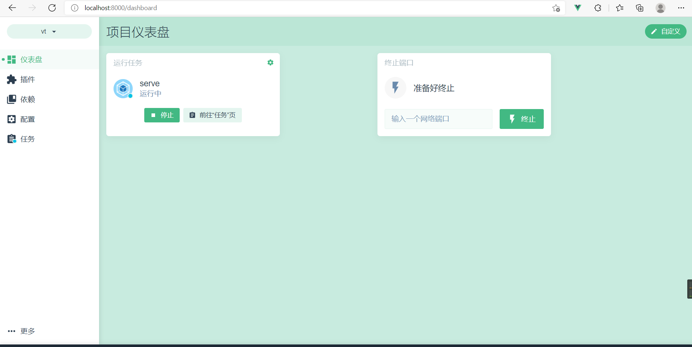
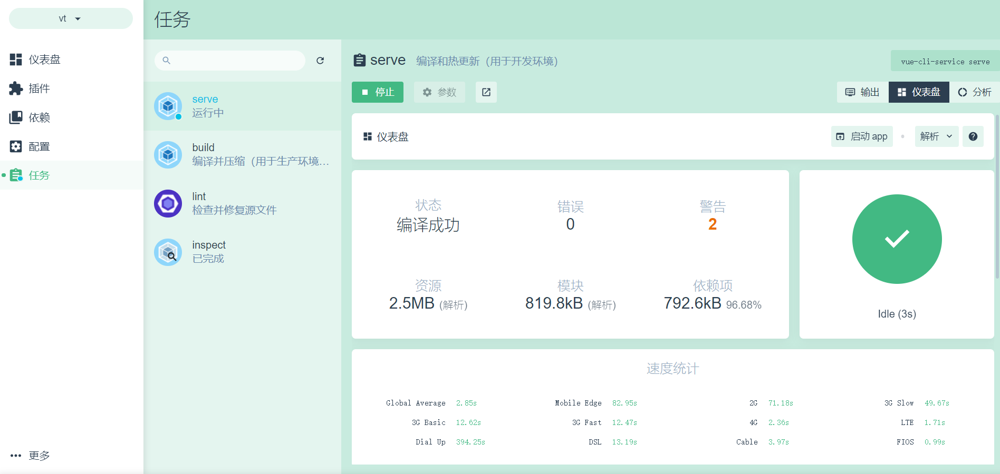
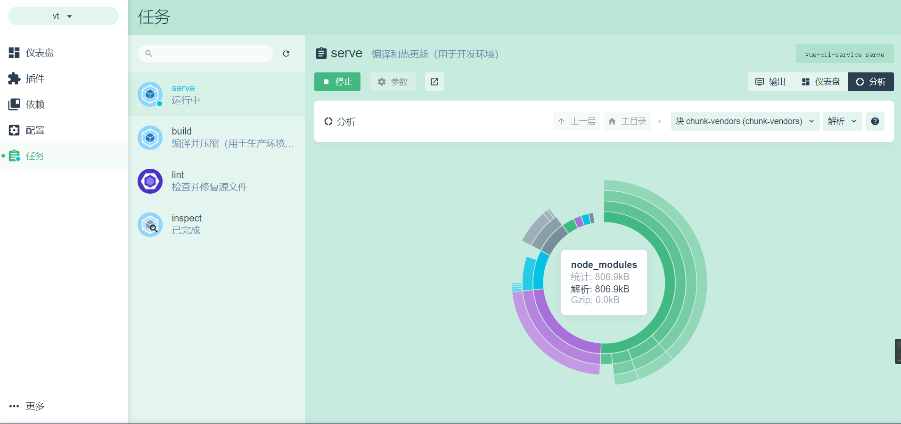

## 前言

首先这并不是教程，这是一个Vue前端开发的记录与心得系列，用来记录一个纯小白的学习经历和开发历程，其中可能有相当多的错误和不足之处，欢迎大家指出任何的问题。接下来准备每天更新一次博客，督促自己绝不拖延绝不摆烂。


## 今日开发进度

### 项目创建

本项目基于vue3.x, vue-cli4.x，使用ide主要为webstorm。（vue-cli需要3.0以上的版本为了使用vue ui，至于为什么要用vue3呢...，新就是好！×）

webstorm选择创建vue项目，创建时默认为vue2.x版本。（后来发现如果想创建vue3的项目其实不该这么做，遇到的问题如[下文](#问题)）

package.json的包配置如下：

```js
  "dependencies": {
    "core-js": "^3.6.5",
    "vue": "^3.1.5",
    "vue-router": "^4.0.11",
    "vuetify": "^3.0.0-alpha.10"
  },
  "devDependencies": {
    "@vue/cli-plugin-babel": "~4.5.0",
    "@vue/cli-plugin-eslint": "~4.5.0",
    "@vue/cli-service": "~4.5.0",
    "@vue/compiler-sfc": "^3.1.5",
    "babel-eslint": "^10.1.0",
    "eslint": "^6.7.2",
    "eslint-plugin-vue": "^6.2.2"
  },
```

这里改了vue的版本到3.x。目前添加了vue-router（用于管理路由）、vuetify（提供了优秀的ui组件）【目前兼容vue3.x的vuetify3仍是alpha版本，可能会有未知的问题】。后续看情况再添加。

添加包可以通过：

1、在package.json中添加完后执行yarn install （用npm也是同理）

2、执行yarn add <包名> ...（感觉不如第一种方便）

3、使用可视化管理工具（见[下文](#可视化)，看着方便不过感觉也不如第一种来的简单直接）


<h4 id="问题">启动的过程中遇到的问题</h4>

**问题一：**

	Error: Cannot find module '@vue/compiler-sfc/package.json'

**参考：**[upgrade - After upgrading to vue 3 : "Cannot find module '@vue/compiler-sfc/package.json' " - Stack Overflow](https://stackoverflow.com/questions/63863222/after-upgrading-to-vue-3-cannot-find-module-vue-compiler-sfc-package-json)

**原因：**

vue-template-compiler只适用于vue2，vue3应该使用@vue/compiler-sfc。

**解决方法：**

```
yarn add vue@next
yarn add @vue/compiler-sfc -D
yarn remove vue-template-compiler
```


**问题二：**

	 warning  in ./src/main.js
	"export 'default' (imported as 'Vue') was not found in 'vue'

**参考：**[vue.js - "export 'default' (imported as 'Vue') was not found in 'vue' - Stack Overflow](https://stackoverflow.com/questions/63768491/export-default-imported-as-vue-was-not-found-in-vue)

**原因：**

> The reason this is happening is because in Vue 2, Vue provides a default export `export default vue`, which allows BootstrapVue to use `import Vue from 'vue'`.
>
> However, in Vue 3 this has changed, and Vue does no longer provide a default export, and instead uses named exports. So when BootstrapVue uses the following line `import Vue from 'vue'`, the error occurs.

**解决：**

main.js里改掉：

```js
import {createApp} from 'vue'
import App from './App.vue'

const app = createApp(App);
app.mount('#app');
```

也许一开始就不该贪省事webstorm里直接创建项目了，不过就将错就错吧。


**问题三：**

	 WARN  
	Couldn't parse bundle asset "...\dist\js\chunk-vendors.js".
	Analyzer will use module sizes from stats file.

**原因：**

未知


<h4 id="可视化">项目可视化管理工具 </h4>

vue-cil3.0+的版本中加入了一个可视化的管理工具，提供了很多方便，通过命令行输入以下指令启动：

	vue ui

没有此功能代表版本过低，需要更新。

查看版本：

	vue -V

更新：

	npm uninstall vue-cli -g
	npm install @vue/cli -g
工具启动，默认使用的是本地的8000端口，若端口被占用则会开启在其他端口，程序会自动打开浏览器进入，大致页面：



仪表盘界面可以自定义，能添加任务的快捷启动；插件界面和依赖界面能对插件、依赖进行管理和添加。配置界面可以管理一些基本设置；任务界面能执行vue-cli-service的任务以及package.json中定义的任务。

vue ui对我来说非常不错的地方在于这里可以看到很多的分析数据，非常方便，有一个直接明了的ui让人神清气爽。



